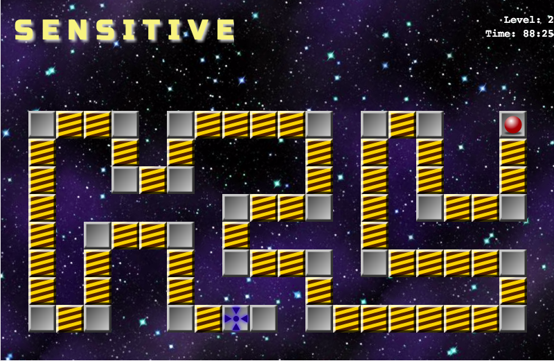
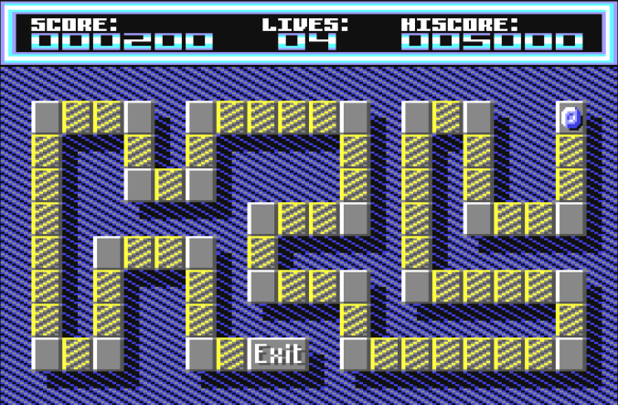

SensitiveJS
===========

> A remake of the good-old C64 game "Sensitive", in JavaScript, using the Phaser Game framework.

Sensitive (1991 Oliver Kirva, see http://www.lemon64.com/?game_id=2258) was a game I played for weeks and months with great enthusiasm.
Finally I got the nerve to create a remake, using web technologies (Phaser IO, the famous game framework). This is an ongoing work in progress.

Screens
--------

### SensitiveJS remake



### Original from 1991 by Oliver Kirva




Architecture notes
-------------------

### Game Layout

```
+---------------------------------------------------------+
|   Screen Dimension: 800x520                             |
|                                                         |
|    Title / Score   (Height: 120)                        |
|                                                         |
+---------------------------------------------------------+
|                                                         |
|                                                         |
|                                                         |
|                                                         |
|                Play field: 20x10 stones                 |
|                Stone size: 40                           |
|                                                         |
|                                                         |
+---------------------------------------------------------+
```

### Special Stone configurations

#### Player

The player is set in the Object layer "sprites" in TiledMap editor. It has to have the name `player`, so that the game logic can find it during initialization.

#### Target

The target is set in the Object layer "sprites" in TiledMap editor. It has to have the name `target`, so that the game logic can find it during initialization.

#### Teleport Stones

Teleport Stones  have to be added  in the Object layer "sprites" in TiledMap editor. They must have the name "teleport" so that the game can find it. Besides, the two
custom properties MUST be set:

* `teleportNr`: The ID / Nr of this teleporter
* `teleportTo`: The ID / Nr of its peer teleporter stone (where the player will be transported to)

Build
------

```
$ npm install
$ npm run build # production build
- or -
$ npm watch # dev watch
```

Working
--------

* Levels 1-9 playable (including normal, double, teleporter stones)

TODO
-------

* Kid's levels (easier, more to come)
* settings page (disable sound, e.g.)
* better splash sceen + loader

Copyright Violations
--------------------
Attention: At the moment, I didn't check copyright of the game assets! This is a known issue I have to resolve.
The following assets are not copyright checked:
- Galaxy background in game
- Explosion animation

The rest of the assets (bricks, sounds, other images) are either created by myself or from https://opengameart.org.
